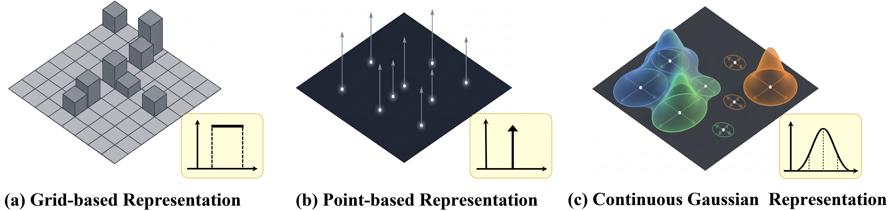
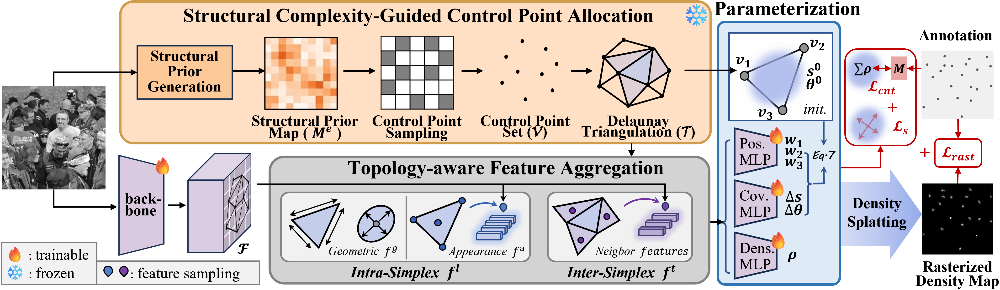
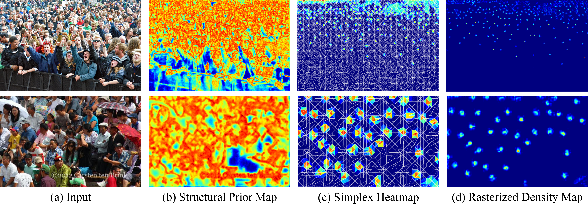

<div align="center">

# GDSNet: Gaussian Density Splatting Network

### GDSNet · NeurIPS 2026

**Miao Shang · Yabin Wang · Xiaopeng Hong***

Faculty of Computing, Harbin Institute of Technology

<sup>* Corresponding author</sup>


[](https://arxiv.org/abs/2610.10396)

**Representing crowds as continuous, mass-carrying Gaussian fields.**

[Paper PDF](https://arxiv.org/pdf/2610.10396) · [Overview](#overview) · [Method](#method) · [Results](#results) · [Code Availability](#code-availability) · [Citation](#citation)

</div>

> **Code availability:** The implementation is not publicly available yet. We plan to release the code after completing the journal extension of this work. Release updates will be posted in this repository.

## Overview

GDSNet represents a crowd as a superposition of continuous 2D Gaussian primitives. Each primitive carries a learnable **density mass** and an adaptive **spatial support**, enabling both spatial density prediction and analytical count estimation.

<p align="center">
  
</p>

<p align="center"><em>From rigid density grids and isolated points to continuous Gaussian density fields.</em></p>

The framework combines:

- **Image-adaptive primitive allocation:** A structural prior guides control-point sampling and Delaunay triangulation.
- **Structured Gaussian learning:** Simplex-constrained geometry and topology-aware feature aggregation couple local appearance, geometry, and neighboring primitives.
- **Density-aware optimization:** Differentiable rendering provides spatial supervision, while mass summation and geometric regularization support accurate counting and stable shapes.

## Method

<p align="center">
  
</p>

**1. Allocate structural control points.** A frozen structural estimator provides an image-adaptive prior. Sampled control points form a Delaunay mesh, whose simplices provide local support regions for Gaussian prediction.

**2. Aggregate local and neighboring features.** Each simplex combines geometric descriptors with sampled backbone features. Features from neighboring simplices supply explicit primitive-level context.

**3. Predict mass-carrying Gaussians.** The network predicts each primitive's simplex-constrained center, anisotropic scales, orientation, and non-negative density mass.

**4. Render density or return the count.** The predicted field is

$$
\hat{\mathcal{D}}(x)=\sum_i\rho_i\mathcal{N}(x;\mu_i,\Sigma_i).
$$

Because each Gaussian basis is normalized, the analytical total count is

$$
\hat M=\int_{\mathbb{R}^2}\hat{\mathcal{D}}(x)\,dx=\sum_i\rho_i.
$$

Training uses the rendered density field for spatial supervision. At inference, count-only prediction can skip rasterization; spatial density output additionally renders the learned Gaussian field.

## Results

### Crowd counting benchmarks

Results reported in the conference manuscript. Lower is better for both metrics; the MSE column follows the paper's metric naming convention.

| Dataset | MAE ↓ | MSE ↓ |
| :--- | ---: | ---: |
| ShanghaiTech Part A | **48.8** | **76.5** |
| ShanghaiTech Part B | **5.4** | **8.0** |
| JHU-Crowd++ | **52.8** | **227.6** |
| UCF-QNRF | **75.9** | **130.5** |
| NWPU-Crowd | **68.7** | **294.2** |

### Qualitative density prediction

<p align="center">
  
</p>

**Left to right:** input image, structural prior, simplex mass heatmap, and rendered density map. The examples illustrate adaptive spatial allocation across dense and sparse crowd scenes. Simplex heatmaps visualize predicted masses over triangular supports; the final density maps are rendered from continuous Gaussian primitives.

## Code Availability

This repository currently presents the conference work and its results. **The implementation remains unreleased while we prepare the journal extension.** Code release is planned after the extension is completed; no release date has been announced.

You can watch this repository for release updates.

## Citation

If you find this work useful, please cite:

```bibtex
@inproceedings{shang2026gdsnet,
  title     = {Gaussian Density Splatting Network},
  author    = {Shang, Miao and Wang, Yabin and Hong, Xiaopeng},
  booktitle = {Advances in Neural Information Processing Systems},
  year      = {2026}
}
```

## Contact

For questions about this work:

- **Miao Shang:** [miaos0522@gmail.com](mailto:miaos0522@gmail.com)
